# How the viewer inspects pages it isn't allowed to touch

This is the plain-language version of how the app works: why we need an agent inside every page, how the two sides talk with `postMessage`, and how hovering, clicking, outlines, the layers panel and the inspector all come out of that. For the precise protocol, state model and failure handling, see the [README](README.md).

## The problem

Your app runs at `localhost:5173`. The previews load pages from `localhost:4001`. Because the port differs, the browser treats them as two different websites. Its security rules (the same-origin policy) stop one site from reaching into another site's page. So our app can show the iframe, but it can't read the page's elements, measure a button, or listen to clicks inside it.

It's like looking at a room through a sealed glass window: you can see in, but you can't touch anything.

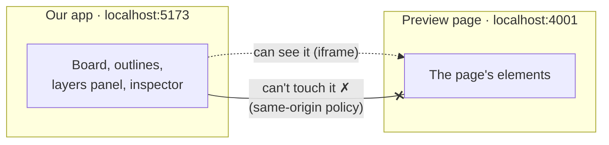

## The fix: put a helper inside the room

Each page is allowed one extra `<script>` tag, so we use it to load `agent.js`. That script runs inside the page, on the page's own origin, which means it can do everything we can't:
- read the elements;
- measure where things are;
- catch clicks before the page sees them;
- notice when the page changes.

So there are two programs:
- **The host** (our React app) draws the board, the outlines, the layers panel and the inspector, and never touches the page.
- **The agent** (inside each iframe) does all the hands-on work with the page.

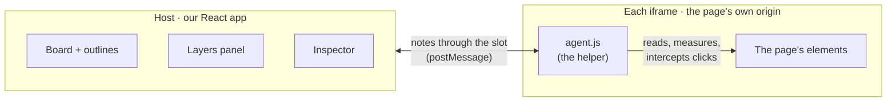

There are 24 previews, so there are 24 agents, one per iframe, each talking to the same host.

## How they talk: `postMessage`

The browser gives cross-origin windows exactly one legal way to communicate: `window.postMessage`. Think of it as passing notes through a slot in the glass. Only plain data can pass through, never live objects like a DOM element.

```js
// agent → host
window.parent.postMessage({ kind: "pointer", node: {...}, rect: {...} }, hostOrigin)

// host → agent
iframe.contentWindow.postMessage({ kind: "mode", mode: "interact" }, "http://localhost:4001")
```

Each side listens with `window.addEventListener("message", ...)`, checks who the note came from, and ignores anything it doesn't recognise.

## The handshake

1. The page loads, and the agent starts up first: it's the first tag in `<head>`.
2. The agent sends **"hello, I'm here"**, and keeps repeating it until someone answers.
3. The host answers **"welcome, your session id is `scr-01#1`, and we're in Select mode"**.
4. From then on, every note carries that session id.

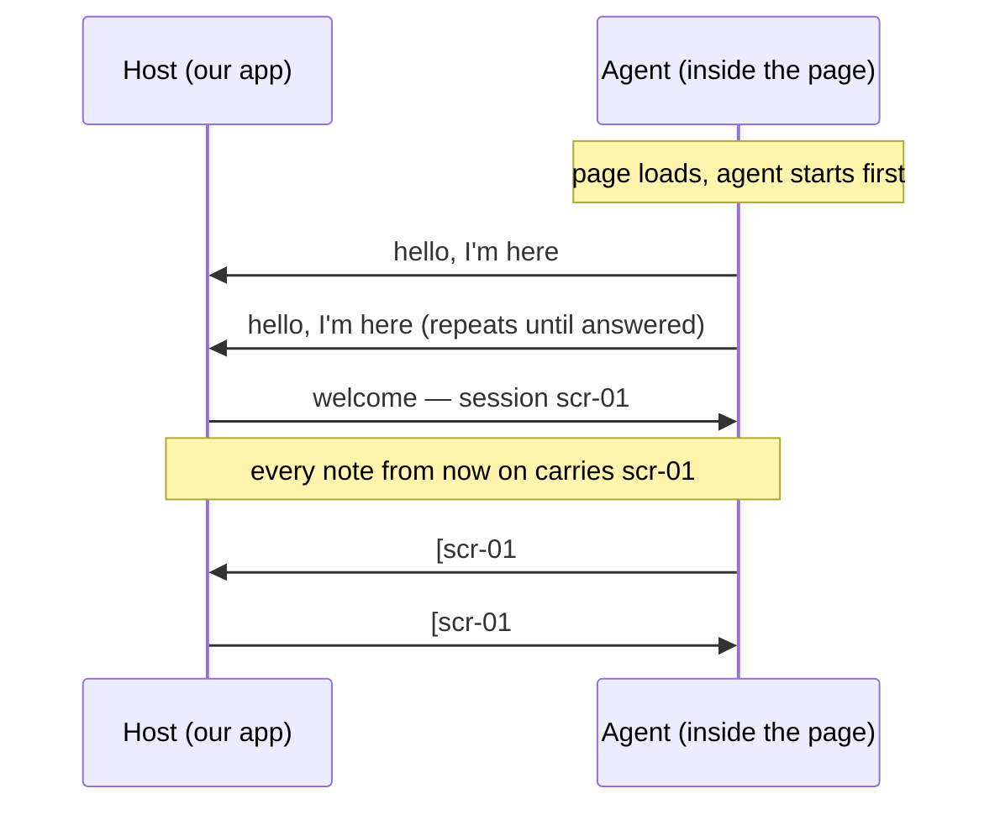

If the page navigates (you click a link in Interact mode), the old agent dies with the old page. The new page's agent says "hello" again with a different identity. The host sees that, knows it's a new page, clears that preview's selection and layers, and ignores any late notes still marked with the old session id.

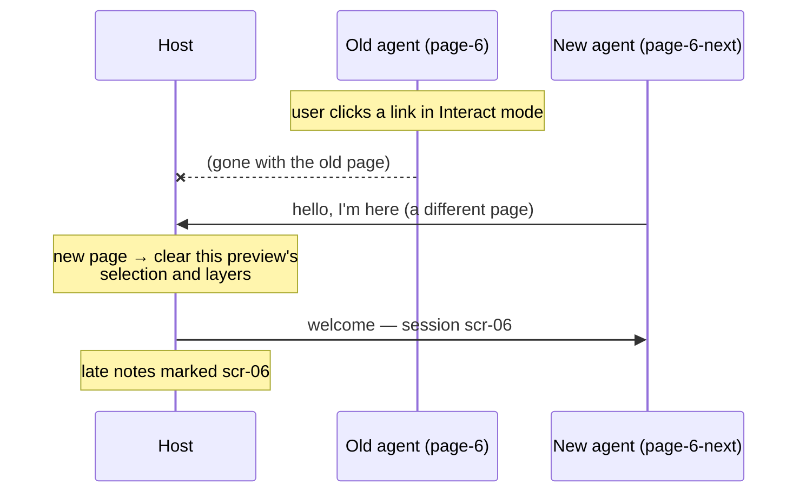

## What happens when you hover

1. You move the mouse over a preview. The browser sends that movement to the **page**, not to our app.
2. The agent catches it and asks the page which element is visually on top at that point (`document.elementFromPoint`). That's why disabled buttons, SVG icons and things under the sticky header all work.
3. The agent sends a note: **"pointer is over element #12, it's called `button.primary`, its box is x 120, y 340, 124×45"**.
4. The host draws an orange 1 px rectangle at that spot **on top of** the iframe, in a transparent layer above the board.

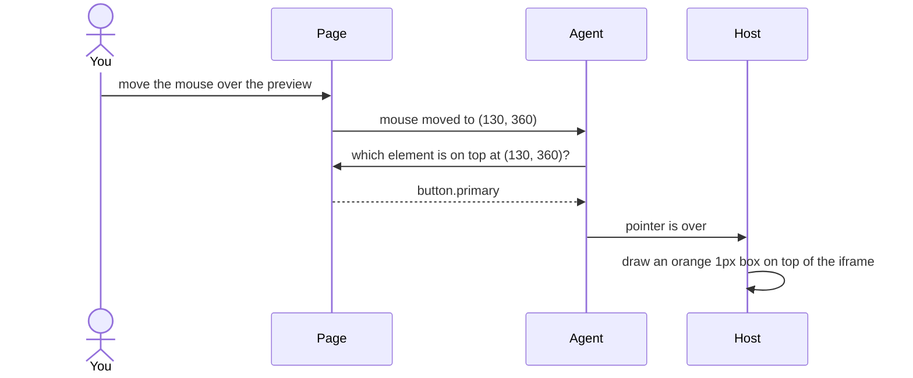

The outline is never inside the page. It's painted on the glass in front of it. That's why it stays a crisp 1 px at any zoom, and why it never disturbs the page itself.

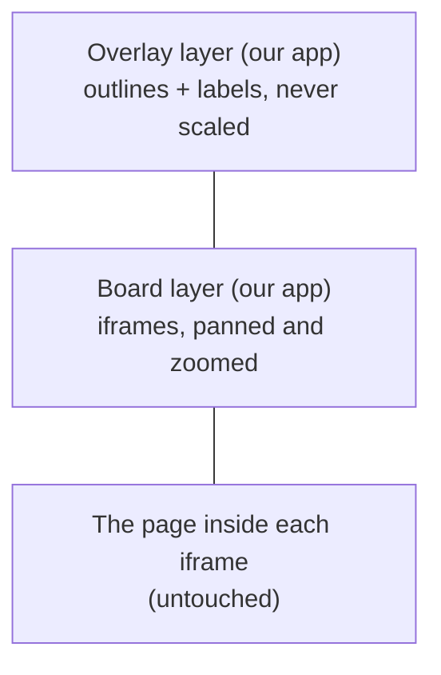

## Element ids instead of elements

A DOM element can't go through the slot, so the agent gives each element a **ticket number** (we call it a *nid*) and keeps the real element on its side. The host only ever stores numbers: "element #12 is selected". When the host asks about #12, the agent looks up which real element that is.

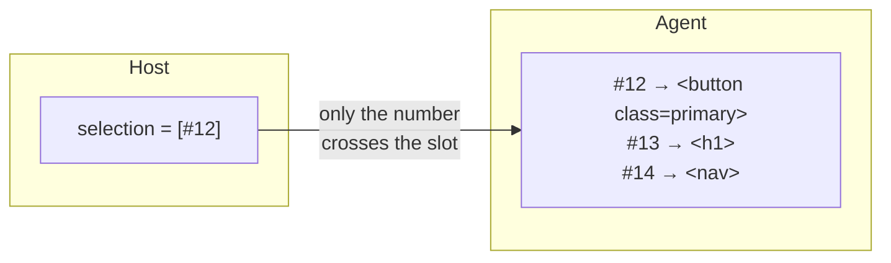

This is also how selection survives re-renders. Page 4 throws away and rebuilds its list every 2 seconds. When the agent sees ticket #12's element disappear, it looks for the newly built element that is provably the same one: same `data-key`, or same structure and text. If exactly one matches, the ticket moves to it, so the host's "#12 is selected" stays true. If no element matches, or more than one does, it tells the host "#12 is gone" instead of guessing.

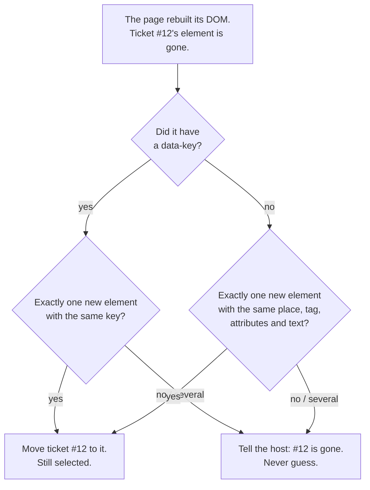

## What happens when you click

In **Select mode**, the agent intercepts mouse-down, click, submit and key presses *before the page sees them*, and cancels them. So links don't navigate, buttons don't fire, and inputs don't get focus. It sends a note instead: **"user clicked element #12, Shift was/wasn't held"**. The host updates the selection.

In **Interact mode**, the agent steps aside and the page behaves normally.

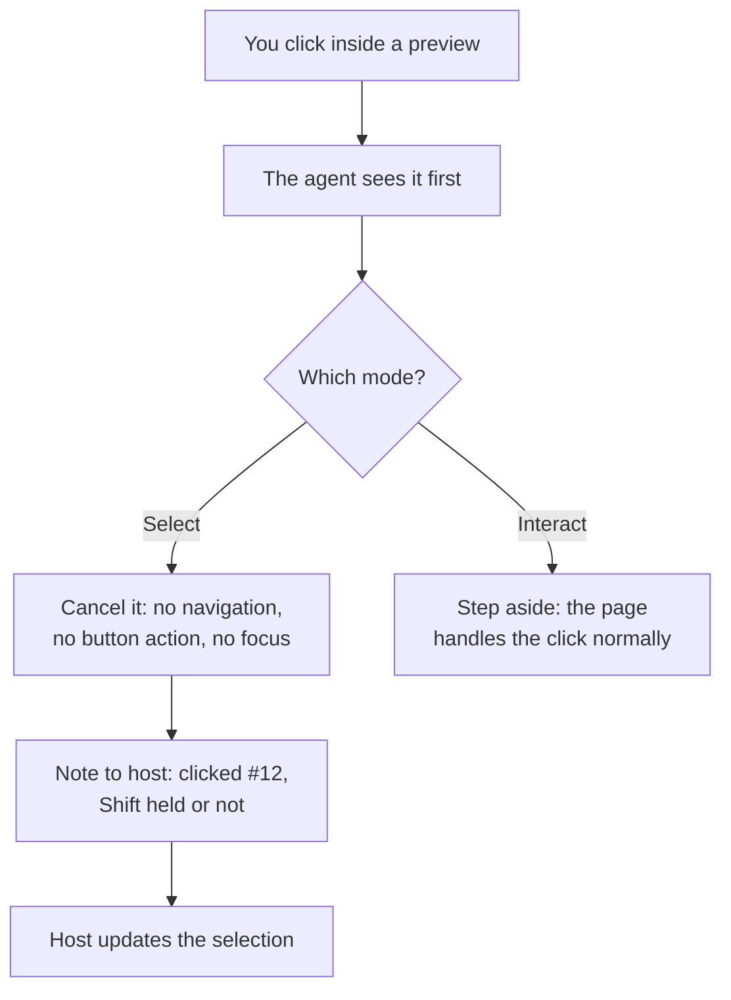

Keys work the same way. After you click inside a preview, the keyboard belongs to the iframe, so the agent forwards V, I, Escape, Enter and Tab to the host.

## Who actually receives the mouse?

When the pointer is over an iframe, the browser delivers every mouse event to the page inside it, not to our app. Our app only sees the pointer enter and leave the `<iframe>` element itself, with no position or element information.

That's why the agent is needed. It lives inside the page, so it receives those events too:

```ts
// frontend/src/agent/index.ts
window.addEventListener("pointermove", (e) => {
  lastPoint = { x: e.clientX, y: e.clientY };
  refreshHover();               // elementFromPoint → note to the host
}, { capture: true, passive: true });
```

The agent **only listens to hover, it doesn't block it**. The page gets the same mouse moves as normal, so its own hover behaviour still runs in Select mode: CSS `:hover` styles, `mouseover` handlers and the cursor shape. Hovering a page button still shows its hover colour, and our orange outline is drawn on top.

Clicks and keys are different:

| Event | Select mode | Interact mode |
|---|---|---|
| Mouse move / hover | The page gets it, and the agent watches it | The page gets it |
| Mouse down, click, submit, keys | **The agent cancels them before the page sees them** and sends "clicked #12" to the host | The page gets them normally |
| Wheel (plain) | The page scrolls | The page scrolls |
| Ctrl + wheel | The agent cancels it and asks the host to zoom the board | Same |

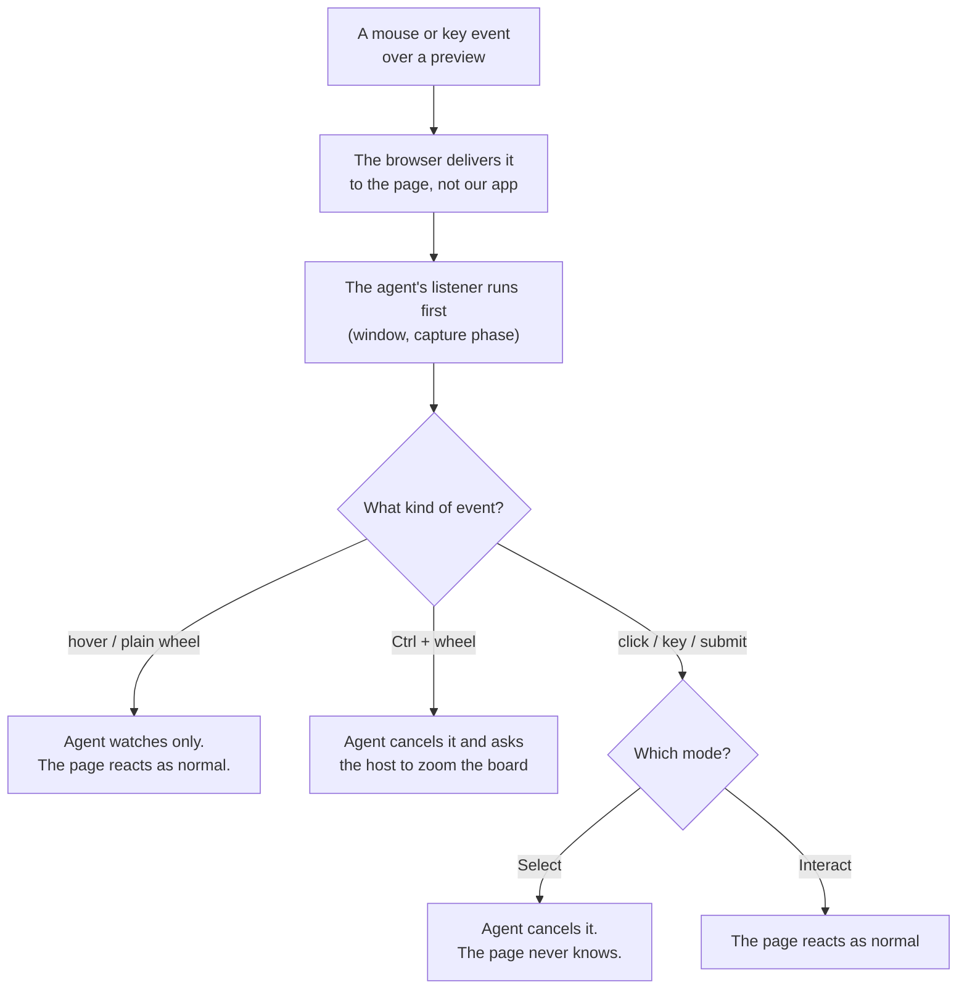

The agent can cancel clicks before the page reacts because it's the first `<script>` in `<head>`. Its listeners are attached at the outermost level (`window`, capture phase), so they run before anything the page registers. In Select mode it calls `preventDefault()` and `stopImmediatePropagation()`, and the page never finds out a click happened.

Hover is deliberately left alone. Stopping the page from reacting to hover would need an invisible layer over it, and that layer would also stop plain wheel scrolling in the preview, which the brief requires.

## Keeping the outline glued

The host tells the agent: **"watch #12 (selected) and #30 (hovered)"**. While anything is being watched, the agent re-measures those few elements on every animation frame and sends new boxes only when something moved. That covers scrolling, resizing, animation and the page changing itself.

The host then converts page coordinates to screen coordinates (preview position on the board × zoom + pan) and moves the rectangle.

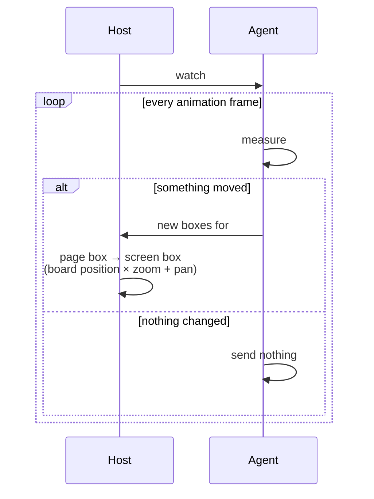

## The layers panel and inspector

These work by asking questions:
- "What are the children of element #5?" The agent replies with a list of names and ticket numbers, which is how rows load on expand.
- "Show me the path down to #40." It replies with every level at once, which is how the panel can open 30 levels deep in one go.
- "Search for 'Setting 7'." The agent searches the whole page, including parts never opened.
- For the inspector, the agent also sends live computed values (size, colours, fonts) for the selected elements.

Each question has an id and a deadline. If the answer doesn't arrive in time (3 s for a row, 10 s for "are you alive?"), the host shows an error for that part only.

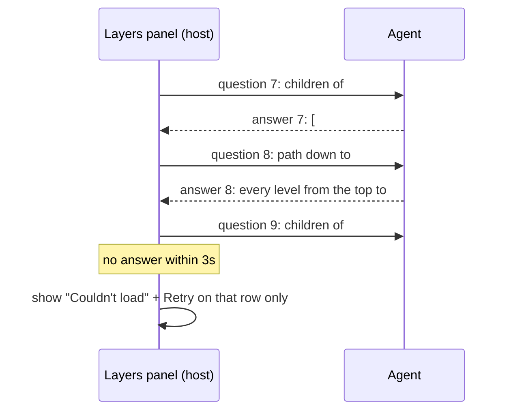

## In one sentence

The pages are behind glass, so we put a small helper inside each one. It does all the touching and measuring, and passes short notes through the only slot the browser allows (`postMessage`). The app reads those notes and draws everything on top of the glass.

## Where to look in the code

| Idea in this doc | Code |
|---|---|
| The notes and their shapes | `frontend/src/protocol/index.ts` |
| The helper inside the page | `frontend/src/agent/index.ts` |
| Ticket numbers and re-binding | `frontend/src/agent/identity.ts` |
| Handshake, deadlines, "are you alive?" | `frontend/src/host/bridge/connection.ts` |
| What the host does with each note | `frontend/src/host/bridge/handlers.ts` |
| Drawing on the glass | `frontend/src/host/overlay/Overlay.tsx` |
| Layers questions | `frontend/src/host/layers/actions.ts` |
